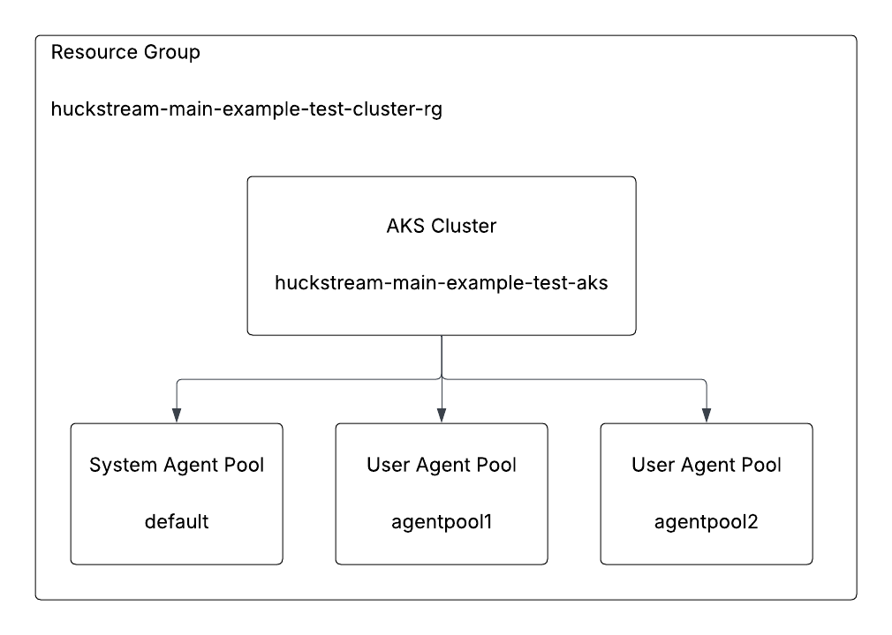

Pulumi Typescript Azure Kubernetes Service Test Cluster
=======================================================

Overview
--------

This respository contains two Pulumi programs that deploy and manage an identical AKS cluster using different providers, one using the Azure Native provider and the other using the Azure Classic provider. This cluster is relatively simple, deploying the high level architecture shown here:



The purpose of this material is to facilitate the testing, reproduction, and documentation of several features/issues related to deploying, importing and managing AKS clusters using the two Pulumi provider options.

Azure Authentication
---------------------

Both Pulumi programs assume there is an ESC environment named `azure/main` containing the necessary credentials to authenticate to Azure. The test organization used for the video series uses the Azure OIDC integration method, and this environment has the content:

```yaml
values:
  azure:
    login:
      fn::open::azure-login:
        clientId: xxxxxxxx-xxxx-1xxx-yxxx-xxxxxxxxxxxx
        tenantId: xxxxxxxx-xxxx-2xxx-yxxx-xxxxxxxxxxxx
        subscriptionId: xxxxxxxx-xxxx-3xxx-yxxx-xxxxxxxxxxxx
        oidc: true
  environmentVariables:
    ARM_USE_OIDC: 'true'
    ARM_CLIENT_ID: ${azure.login.clientId}
    ARM_TENANT_ID: ${azure.login.tenantId}
    ARM_OIDC_TOKEN: ${azure.login.oidc.token}
    ARM_SUBSCRIPTION_ID: ${azure.login.subscriptionId}
```
See the [Pulumi Azure OIDC documentation](https://www.pulumi.com/registry/packages/azure-native/installation-configuration/#optional-move-pulumi-config-to-your-esc-environment) for more information.


