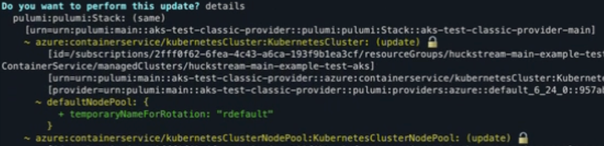

Pulumi Typescript Azure Kubernetes Service Test Cluster
=======================================================

Overview
--------

This respository contains two Pulumi programs that deploy and manage an identical AKS cluster using different providers, one using the Azure Native provider and the other using the Azure Classic provider. This cluster is relatively simple, deploying the high level architecture shown here:


The purpose of this material is to facilitate the testing, reproduction, and documentation of several features/issues related to deploying, importing and managing AKS clusters using the two Pulumi provider options.

Azure Authentication
---------------------

Both Pulumi programs assume there is an ESC environment named `azure/main` containing the necessary credentials to authenticate to Azure. The test organization used for the video series uses the Azure OIDC integration method, and this environment has the content:

```yaml
values:
  azure:
    login:
      fn::open::azure-login:
        clientId: xxxxxxxx-xxxx-1xxx-yxxx-xxxxxxxxxxxx
        tenantId: xxxxxxxx-xxxx-2xxx-yxxx-xxxxxxxxxxxx
        subscriptionId: xxxxxxxx-xxxx-3xxx-yxxx-xxxxxxxxxxxx
        oidc: true
  environmentVariables:
    ARM_USE_OIDC: 'true'
    ARM_CLIENT_ID: ${azure.login.clientId}
    ARM_TENANT_ID: ${azure.login.tenantId}
    ARM_OIDC_TOKEN: ${azure.login.oidc.token}
    ARM_SUBSCRIPTION_ID: ${azure.login.subscriptionId}
```
See the [Pulumi Azure OIDC documentation](https://www.pulumi.com/registry/packages/azure-native/installation-configuration/#optional-move-pulumi-config-to-your-esc-environment) for more information.


Import an Exising AKS Cluster
-----------------------------

### Summary

This section documents the process of creating and AKS cluster, removing it from Pulumi state management, and then importing the existing AKS cluster into Pulumi using the Azure Classic provider.

### Install Dependencies

This section uses the `aks-test-classic-provider` Pulumi program to deploy and manage the AKS cluster. The program is located in the `classic-provider` directory.

To begin, navigate to the `classic-provider` directory, install dependencies, and initialize a new Pulumi stack:

```bash
cd ./classic-provider
npm install
pulumi stack init main
pulumi stack select main
pulumi install
```

### Deploy AKS Cluster

To deploy the AKS cluster, run:

```bash
pulumi up
```

Video: [Import Existing Cluster: Deploy Cluster](https://www.loom.com/share/268c85ffa6a34bb18971966475feac56?sid=4671d08b-7cb0-47dd-ba8b-f58dd575b527)

### Destroy AKS Cluster Resources with `retainOnDelete: true`

Ensure that the `retainOnDelete: true` option is set on the cluster and agent pool resources:

```typescript
const cluster = new azure.containerservice.KubernetesCluster("aks", {
  name: `${namespace}-${environment}-${name}-aks`,
  ...
  tags,
}, {
  // Ensure that this resource option is set and uncommented
  retainOnDelete: true,
});
```

Once the retain on delete option is set, run `pulumi destroy` on the AKS cluster resource and its dependent resources:

```bash
pulumi destroy \
  --target urn:pulumi:main::aks-test-classic-provider::azure:containerservice/kubernetesCluster:KubernetesCluster::aks \
  --target-dependents
```

Make sure to retrieve the proper resource URN using `pulumi stack -u` and pulling out the URN associated with the `aks` resource. The URN above is correct as long as the project, stack, and resource names have not been changed from this repository's values.

Before confirming and executing the `destroy` command, ensure that the resource group is not included in the resources to destroy, and the plan details show `delete[retain]` and not `delete` for the resources to be removed.

After execution, confirm that the cluster and agent pool resources are still present in the Azure Portal.

`pulumi stack` should now no longer show the AKS cluster and the agent pools, and the live resources are no longer under management.

Video: [Import Cluster: Destroy cluster resources w/ retain](https://www.loom.com/share/0b70349a61794a1183cb13451c691e65?sid=6d0f9d64-5d20-447f-8c08-21ddb23958ba)

### Import Existing Cluster Resources

To import the existing AKS cluster and agent pool resources into Pulumi state management, use the `pulumi import` command.

The Azure resource IDs will be needed for the import process. These can be retrieved from the Azure Portal or using the `az` CLI:

```bash
# AKS Cluster Resource ID
az resource list --resource-group huckstream-main-example-test-cluster-rg --resource-type Microsoft.ContainerService/managedClusters --query "[0].id" -o tsv

# Default Agent Pool Resource ID
az aks nodepool show --resource-group huckstream-main-example-test-cluster-rg --cluster-name huckstream-main-example-test-aks --name default --query id -o tsv

# Agent Pool 1 Resource ID
az aks nodepool show --resource-group huckstream-main-example-test-cluster-rg --cluster-name huckstream-main-example-test-aks --name agentpool1 --query id -o tsv

# Agent Pool 2 Resource ID
az aks nodepool show --resource-group huckstream-main-example-test-cluster-rg --cluster-name huckstream-main-example-test-aks --name agentpool2 --query id -o tsv
```

These IDs can then be used to import the resources into Pulumi state management using multiple `pulumi import` commands:

```bash
# Import the AKS Cluster
pulumi import azure:containerservice/kubernetesCluster:KubernetesCluster aks <aks resource id>

# Import the first agent pool
pulumi import azure:containerservice/kubernetesClusterNodePool:KubernetesClusterNodePool agentPool1 <agentpool1 resource id>

# Import the second agent pool
pulumi import azure:containerservice/kubernetesClusterNodePool:KubernetesClusterNodePool agentPool2 <agentpool2 resource id>
```

alternatively create an `import.json` file:

```json
{
  "resources": [
    {
      "type": "azure:containerservice/kubernetesCluster:KubernetesCluster",
      "name": "aks",
      "id": "<aks resource id>"
    },
    {
      "type": "azure:containerservice/kubernetesClusterNodePool:KubernetesClusterNodePool",
      "name": "agentPool1",
      "id": "<agentpool1 resource id>"
    },
    {
      "type": "azure:containerservice/kubernetesClusterNodePool:KubernetesClusterNodePool",
      "name": "agentPool2",
      "id": "<agentpool2 resource id>"
    }
  ]
}
```

and import using the `pulumi import` command and the import file:

```bash
pulumi import --file import.json
```

once the import is complete, export the stack state to examine the data imported and stored:

```bash
pulumi stack export --file after_import.json
```

Video: [Import Cluster: Import Retained Cluster](https://www.loom.com/share/c1131cf563574c78bcceb2a331511b16?sid=10d022c5-7e5c-4314-a575-c32ea880f08a)

### Refresh State

Run `pulumi refresh` to refresh the state of the stack and ensure there is no data loss:

```bash
pulumi refresh
```

once the refresh is complete, export the stack state to examine the data imported and stored:

```bash
pulumi stack export --file after_refresh.json
```

Video: [Import Cluster: Run Refresh](https://www.loom.com/share/07659688a44f4076b3c4d06a648cbda9?sid=18320027-e649-400d-9682-de567ed4a186)

### Run `pulumi up` to Sync Program & Live Env

Run `pulumi up` to sync the program and live environment:

```bash
pulumi up
```

Note that the `temporaryNameForRotation` property will be modified on the agent pools, and the agent pools will be modified to apply this change:



This will put the agent pools in an `Updating` state, but no changes will be made to the agent pools.

Video: [Import Cluster: Run Update to Sync Program & Live Env](https://www.loom.com/share/deabfb419b2e4614b341f79980f773f1?sid=c22c8611-b2b3-428a-bc90-340af0f69f51)

